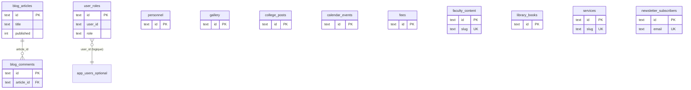

# Relations entre tables & stockage (référence UPG)

## Schéma relationnel (D1 / logique métier)

### Détail des relations

| Relation | Type | Notes |
|----------|------|--------|
| `blog_comments.article_id` → `blog_articles.id` | **N:1**, `ON DELETE CASCADE` | Seule **clé étrangère** explicite dans les migrations Postgres d’origine. |
| `user_roles.user_id` → `auth.users` (Supabase) | **N:1** | Sur **D1**, pas de table `auth.users` : `user_id` est un **TEXT** (UUID du fournisseur d’identité). FK optionnelle si vous créez une table `app_users` plus tard. |

Toutes les autres tables sont **indépendantes** (pas de FK inter-tables dans les migrations actuelles).

---

## Stockage fichiers : Supabase Storage → Cloudflare R2

En Postgres/Supabase, les **fichiers** ne sont pas dans la base : ils sont dans le **bucket** `storage.buckets` nommé `images`, avec des **URLs** référencées en colonnes `TEXT`.

| Colonne (table) | Rôle | Équivalent cible |
|-----------------|------|------------------|
| `personnel.photo_url` | URL photo | URL publique R2 ou URL Worker `/media/...` |
| `blog_articles.image_url` | Image à la une | idem |
| `gallery.image_url` | Image galerie | idem |
| `college_posts.image_url` | Image publication | idem |
| `faculty_content.image_url` | Image faculté | idem |
| `library_books.cover_url` | Couverture | idem |
| `library_books.pdf_url` | PDF | R2 (bucket dédié `documents` ou préfixe `pdfs/`) |
| `fees.pdf_url` | Barème PDF | idem |
| `services.image_url` | Visuel service | idem |

### Modèle recommandé avec R2

1. **Bucket R2** (ex. `upg-images`) : objets `/{folder}/{uuid}-{filename}`.
2. En base D1 : stocker **`r2_key`** (TEXT) **ou** URL complète signée/public selon politique.
3. **Worker** : route `GET /api/v1/media/:key` qui fait `env.IMAGES.get(key)` ou redirection vers domaine R2 public.

Les scripts **SQL** de ce dossier ne créent **pas** de tables R2 (ce n’est pas du SQL) : uniquement colonnes `*_url` / `*_key` comme aujourd’hui.

---

## Fonctions Postgres non portées en D1

- `has_role(user_id, role)` → à réimplémenter en **Worker** (requête `SELECT 1 FROM user_roles WHERE ...`).
- Triggers `update_updated_at_column` → reproduits en SQLite dans `03_triggers_updated_at.sql` (approximation `datetime('now')`).
